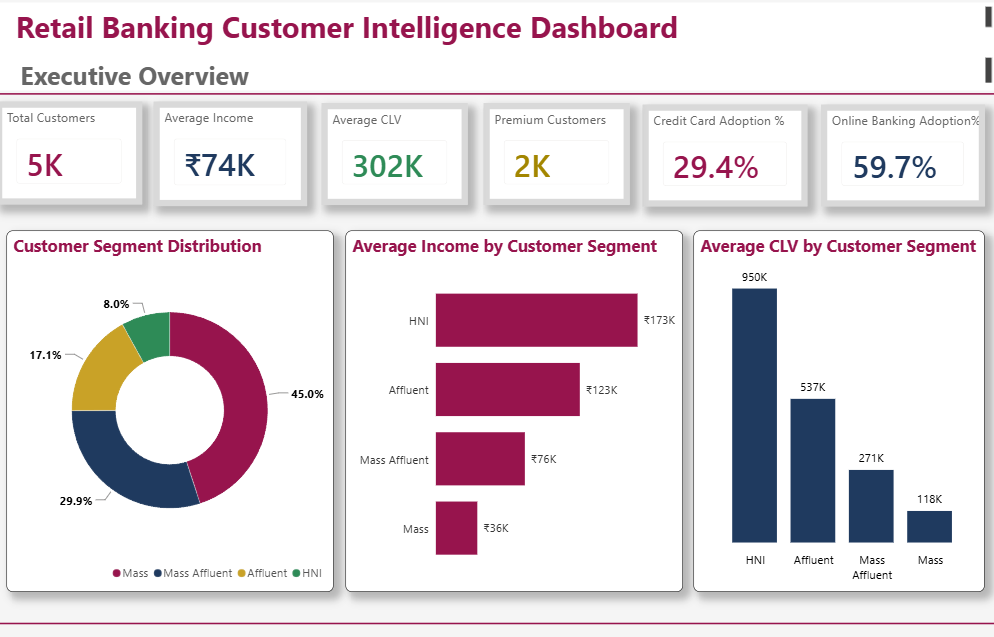
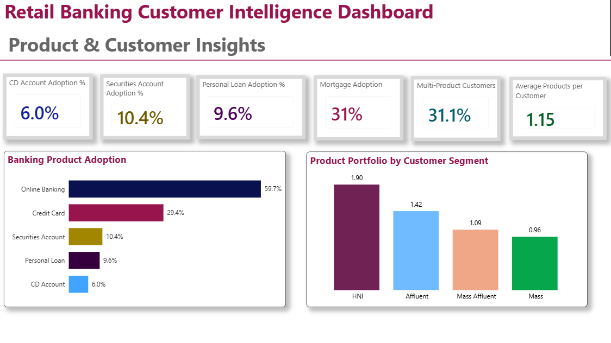
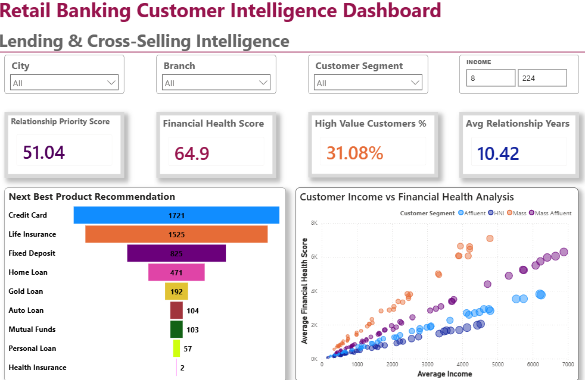
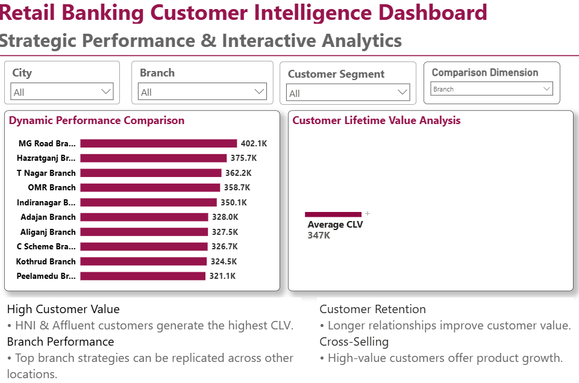

# Retail Banking Customer Intelligence

# Business Intelligence Analysis using Python, SQL and Power BI

An end-to-end Business Intelligence project focused on analyzing retail banking customers and converting customer data into actionable business insights.

The project analyzes **customer demographics, financial characteristics, Customer Lifetime Value (CLV), relationship strength, banking product adoption, branch performance, and cross-selling opportunities** 
to support data-driven decision-making for banking stakeholders.


# Project Overview

Retail banks manage large volumes of customer data across multiple branches and banking products. The challenge is to transform this data into meaningful insights that can support customer engagement, product strategy, and business growth.

This project develops a **Retail Banking Customer Intelligence Platform** that combines:

* Python-based data analysis and exploratory data analysis
* SQL-based business intelligence analysis
* Power BI interactive dashboards
* Customer segmentation and prioritization
* Product recommendation analysis
* Branch performance analysis
* Business recommendations


# Business Problem

Relationship managers and banking executives need a systematic approach to:

* Identify high-value customers
* Understand customer financial behavior
* Prioritize customer engagement
* Analyze banking product adoption
* Identify cross-selling opportunities
* Compare branch performance
* Improve customer retention and relationship management

This project addresses these challenges through data analytics and interactive Business Intelligence dashboards.


# Project Objectives

* Understand customer demographics
* Analyze customer financial behavior
* Measure Customer Lifetime Value (CLV)
* Identify high-priority customers
* Analyze banking product adoption
* Recommend Next Best Products
* Compare branch performance
* Identify cross-selling opportunities
* Build interactive Power BI dashboards
* Generate actionable business recommendations

---

# Dataset

| Feature   | Description                       |
| --------- | --------------------------------- |
| Records   | 5,000                             |
| Columns   | 22                                |
| Domain    | Retail Banking                    |
| Data Type | Structured Data                   |
| Dataset   | Enriched banking customer dataset |

# Major Feature Categories

**Customer Information**

* Age
* Experience
* Family
* Education

**Financial Information**

* Income
* Mortgage
* Average Credit Card Spending (CCAvg)

**Banking Products**

* Credit Card
* Personal Loan
* Securities Account
* CD Account
* Online Banking

**Business Intelligence Features**

* Customer Segment
* Customer Lifetime Value (CLV)
* Financial Health Score
* Relationship Priority Score
* Next Best Product

**Geographic Information**

* Branch
* City
* ZIP Code

---

# Technology Stack

| Tool       | Purpose                                       |
| ---------- | --------------------------------------------- |
| Python     | Data cleaning, EDA and visualization          |
| Pandas     | Data manipulation                             |
| NumPy      | Numerical analysis                            |
| Matplotlib | Data visualization                            |
| Seaborn    | Statistical visualization                     |
| SQL        | Business queries and KPI analysis             |
| Power BI   | Interactive dashboards and business reporting |

---

## 🔄 Project Workflow

```text
Business Understanding
        ↓
Data Understanding
        ↓
Data Cleaning
        ↓
Exploratory Data Analysis
        ↓
Business Insights
        ↓
SQL Analysis
        ↓
Power BI Dashboard
        ↓
Business Recommendations
```

---

# Key KPIs

# Customer KPIs

* Total Customers
* Average Customer Age
* Average Income
* Customer Segment Distribution

# Financial KPIs

* Average Customer Lifetime Value
* Average Financial Health Score
* Average Mortgage
* Average Credit Card Spending

# Product KPIs

* Credit Card Penetration
* Online Banking Adoption
* Securities Account Penetration
* CD Account Penetration
* Personal Loan Acceptance Rate

# Relationship KPIs

* Average Relationship Years
* Average Relationship Priority Score
* High-Priority Customers

# Branch KPIs

* Customers per Branch
* Average CLV per Branch
* Average Financial Health Score per Branch
* Next Best Product Distribution

# Strategic KPIs

* Cross-Sell Opportunity Rate
* High-Value Customer Ratio
* Digital Adoption Rate

---

# Key Analysis Areas

# Customer Analysis

The project examines customer age, income, education, customer segments, financial health, relationship duration and customer lifetime value.

# Product Analysis

Banking products are analyzed to understand adoption patterns and identify opportunities for cross-selling and product penetration.

# Customer Value Analysis

Customer Lifetime Value is used to identify high-value customers and understand the factors associated with long-term customer value.

# Relationship Analysis

Relationship Priority Score and relationship duration are analyzed to help identify customers requiring greater engagement.

# Branch Analysis

Customer value and financial characteristics are compared across branches and cities to identify high-performing locations and potential growth opportunities.

# Product Recommendation Analysis

The **Next Best Product** feature is used to identify potential cross-selling opportunities and support targeted customer campaigns.

---

# Key Business Insights

The analysis identifies several important patterns:

* Most customers belong to the **Mass** customer segment.
* Income and CLV show substantial variation across customers.
* Higher-income customers generally demonstrate higher Customer Lifetime Value.
* Customers holding Securities Accounts tend to have higher CLV.
* CD Account holders represent a particularly high-value customer group.
* Relationship duration is positively associated with customer value.
* Credit card penetration presents additional growth opportunities.
* Online banking adoption indicates further scope for digital engagement.
* Branch-level CLV varies significantly, creating opportunities to identify and replicate high-performing branch strategies.

---

# Business Recommendations

1. **Prioritize high-CLV customers** with personalized retention and relationship strategies.

2. **Target high-income customers** with wealth management and premium banking products.

3. **Increase credit card penetration** among eligible customers through targeted campaigns.

4. **Focus relationship managers on high-value segments**, particularly Affluent and HNI customers.

5. **Use Next Best Product recommendations** to improve cross-selling effectiveness.

6. **Target customers without investment products** for securities and CD account opportunities.

7. **Improve digital adoption** through targeted campaigns for customers who are not currently using online banking.

8. **Analyze high-performing branches** to identify strategies that can be replicated across the wider branch network.

---

# Project Structure

```text
Retail-Banking-Customer-Intelligence/
│
├── Python/
│   └── Retail_Banking_Customer_Intelligence.ipynb
│
├── SQL/
│   └── SQL_Analysis.sql
│
├── PowerBI/
│   └── Retail_Banking_Customer_Intelligence.pbix
│
├── Dashboard/
│   ├── Executive_Dashboard.png
│   ├── Customer_Dashboard.png
│   ├── Branch_Dashboard.png
│   └── Product_Recommendation_Dashboard.png
│
├── Data/
│   └── README.md
│
└── README.md
```

---

# Intended Stakeholders

**Executive Management**
Monitor overall business performance and strategic KPIs.

**Branch Managers**
Compare branch performance and understand customer profiles.

**Relationship Managers**
Prioritize valuable customers and identify cross-selling opportunities.

**Product Teams**
Understand customer segments, product adoption and potential product demand.

---

# Project Outcome

This project establishes an end-to-end Business Intelligence workflow for retail banking, connecting **data analysis → SQL business intelligence → Power BI visualization → actionable recommendations**.

The final objective is to help banking stakeholders make better decisions around:

* Customer retention
* Customer prioritization
* Product adoption
* Cross-selling
* Branch performance
* Customer value
* Digital engagement

---

# Author

**Manan Tulsyan**
B.Tech Chemical Engineering
Birla Institute of Technology, Mesra

---

# Power BI Dashboard

The Power BI dashboard provides an interactive view of customer value, product adoption, lending opportunities, cross-selling potential, and strategic performance.

### 1. Executive Overview

Provides a high-level view of customer base, average income, Customer Lifetime Value (CLV), premium customers, credit card adoption, online banking adoption, and customer segment performance.



---

### 2. Product & Customer Insights

Analyzes banking product adoption, product portfolio by customer segment, and overall customer product engagement.



---

### 3. Lending & Cross-Selling Intelligence

Highlights relationship priority, financial health, high-value customers, relationship duration, Next Best Product recommendations, and customer income versus financial health.



---

### 4. Strategic Performance & Interactive Analytics

Provides branch-level performance comparison and Customer Lifetime Value analysis with interactive filters for city, branch, customer segment, and comparison dimensions.



---

# Project Components

| Component | Description |
|---|---|
| **Python** | Data cleaning, exploratory analysis and visualization |
| **SQL** | Data validation, customer analysis, product analysis, branch analysis and advanced business queries |
| **Power BI** | Interactive dashboards and strategic KPI analysis |
| **Dataset** | Enriched retail banking customer dataset |
